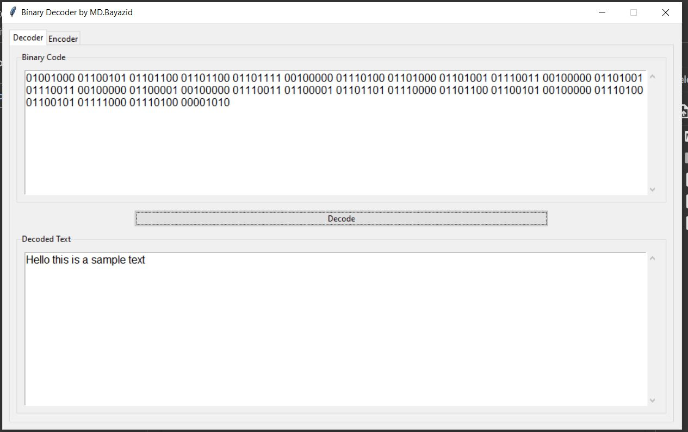

# Binary Decoder by MD. Bayazid

This is a simple GUI-based Binary Decoder and Encoder application built using Python and the Tkinter library. The application allows users to convert text to binary and vice versa.

## Features

- **Binary to ASCII Decoder**: Convert binary code to human-readable text.
- **ASCII to Binary Encoder**: Convert text to binary representation.
- **User-friendly GUI**: Built with Tkinter for a simple and intuitive interface.
- **ScrolledText Widgets**: To input large amounts of text or binary data.

## Requirements

- Python 3.x
- Tkinter (Usually included with Python)
- No additional libraries are required.

## Installation

To run this project, follow these steps:

1. Clone this repository to your local machine:
    ```bash
    git clone https://github.com/bayazid-bit/Binary-Decoder.git
    ```

2. Navigate to the project folder:
    ```bash
    cd Binary-Decoder
    ```

3. Run the Python script:
    ```bash
    python main.py
    ```

## How to Use

- **To Encode**: Enter the text you want to convert into binary in the `ASCII Code` section, and click `Encode`.
- **To Decode**: Enter the binary code you want to convert into text in the `Binary Code` section, and click `Decode`.

The results will be shown in the corresponding `Encoded Text` or `Decoded Text` section.

## Example

- **Encoding**: 
    - Input: "Hello"
    - Output: `01001000 01100101 01101100 01101100 01101111`
  
- **Decoding**: 
    - Input: `01001000 01100101 01101100 01101100 01101111`
    - Output: "Hello"

## Screenshot



## Contributing

If you would like to contribute to this project, feel free to fork the repository, make improvements or fix bugs, and submit a pull request.

## License

This project is open-source and available under the [MIT License](LICENSE).

---

Made with ❤️ by MD. Bayazid
